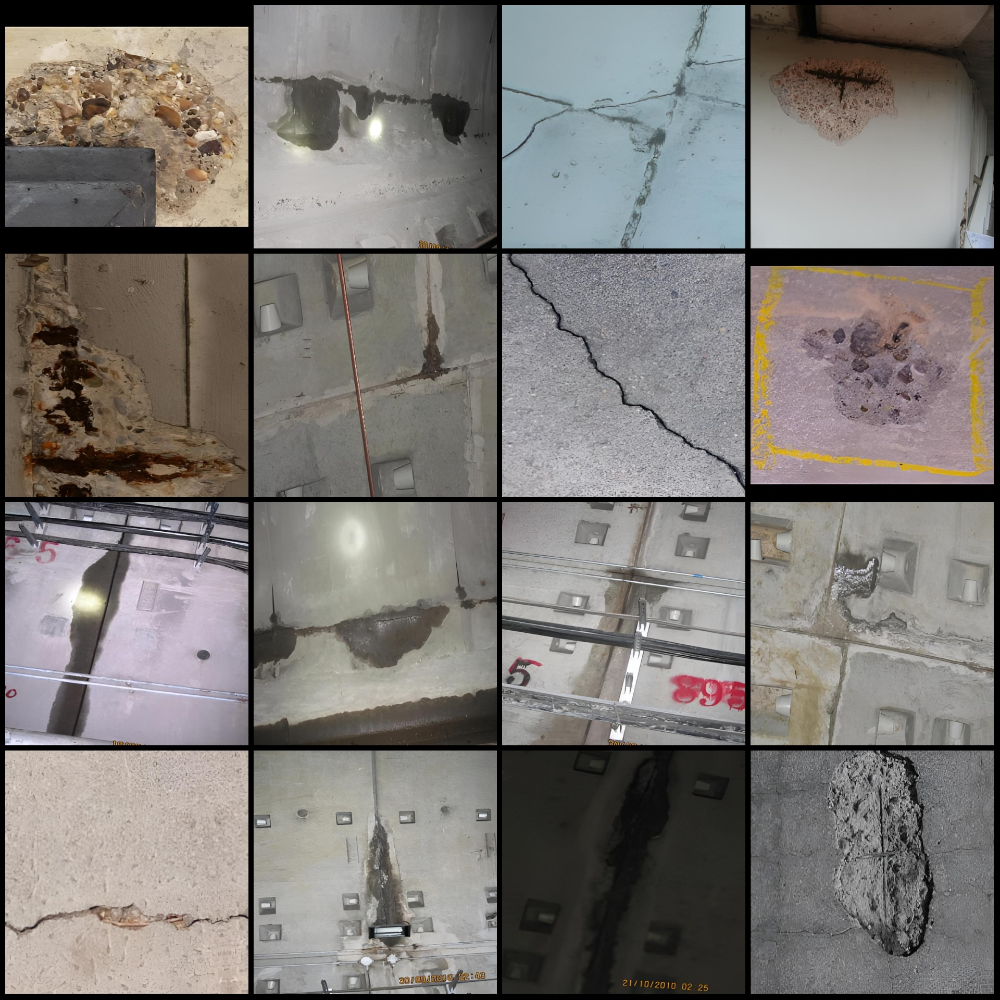
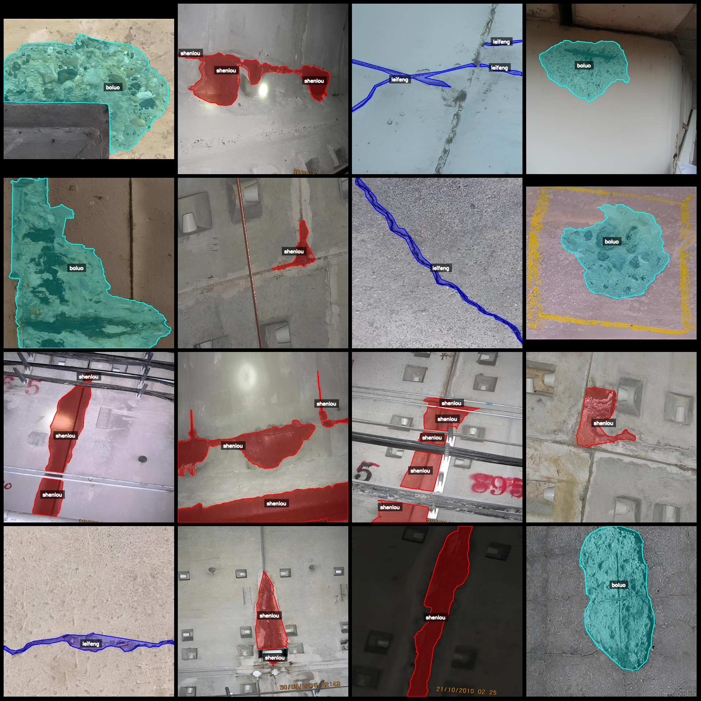
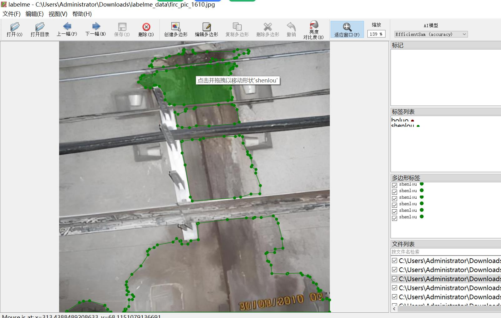

# Tunnel Cracks and Debris Water Leak Identification Data Set in LabelMe Format - 2802 Images with 3 Categories

Please note that some of the images in the dataset have been enhanced.
The dataset format: LabelMe (excluding mask files, only containing jpg images and corresponding json files).
Number of image files (number of jpg files): 2802
Number of annotations (json file number): 2802
Number of annotation categories: 3
Annotation category names: ["boluo", "leifeng", "shenlou"]
Corresponding Chinese category names: [Leakage, Crack, Water Leak]
Number of polygons for each category:
- Boluo count = 1173
- Leifeng count = 1156
- Shenlou count = 2761
Total polygons = 5090

Usage Notes: Use the labelme version 5.5.0.
Image resolution: 624x624
Annotation rules: Draw polygons around categories for drawing.
Special Notice: The dataset can be opened and edited using LabelMe. JSON datasets need to be converted into either Yolo or COCO format for instance segmentation or semantic segmentation.

Disclaimer: This dataset does not guarantee the accuracy of the trained models or weight files.

Image Preview:

Annotation Examples:
- Original Image (pick 16 randomly from the images):

Annotation Drawing Results:

LabelMe Edited Image Example:

Image

Here is a pay link on Stripe ( https://buy.stripe.com/3cs8yP7sY87d0vu9AB ). Please contact me lonlonago@foxmail.com after funding $89, and I will send you a complete data files , thank you!

